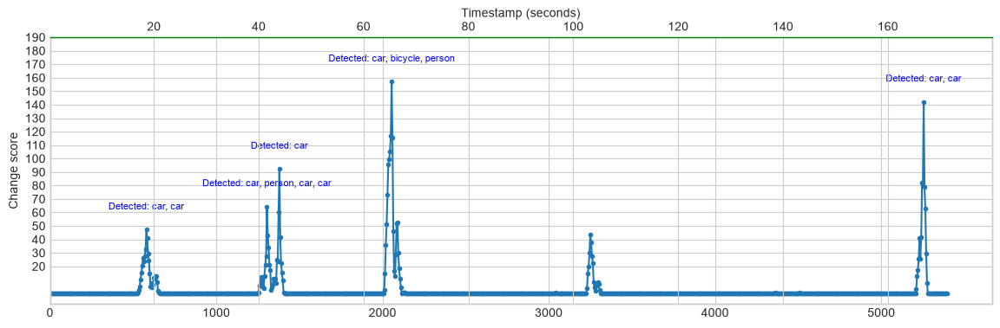
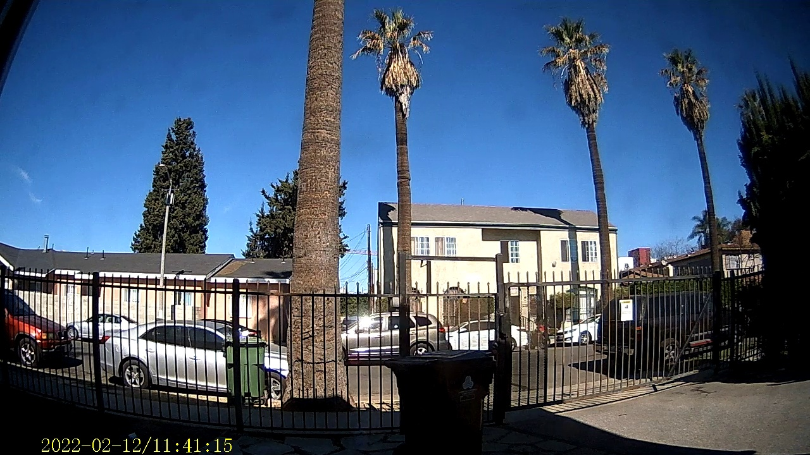
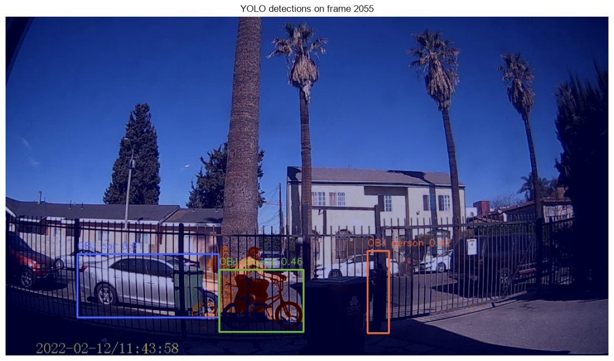

# Dashcam Auto-Watcher: Automated Video Analysis


**Live Demo:** [autovidwatch.streamlit.app](https://autovidwatch.streamlit.app/)

## Motivation

Have an old dashcam collecting hours of footage? Mine was pointed out a front window, quietly recording all day. The problem wasn't capturing events—it was finding them.

Whether you're checking when a package arrived, identifying the exact moment someone approached your car, spotting unusual activity overnight, or simply reviewing traffic outside your home, manually scrubbing through hours of mostly uneventful video is slow and frustrating.

This project turns that process into an automated search. It scans video for significant scene changes, uses YOLO object detection to identify what appears in each event, and generates a timeline showing **when** something happened and **what** was detected (for example: *person*, *car*, *bicycle*, or *dog*). That makes it useful for surveillance, retail analytics, warehouse monitoring, traffic monitoring, parking analytics, and security systems, where you want to jump directly to the moments that matter instead of watching an entire day's recording.



*(Example: A timeline plotting timestamp vs. change score, highlighting exact moments objects were detected.)*

## Overview

This workspace currently centers on a small frame-change workflow built around
`video_analyzer.py` and the companion notebook `video_analyzer_test.ipynb`.
Together they let you identify the car moving through the video, rank the most
changed frames, export the results, and inspect the output interactively.

### Intermediate output



*Car moving through the video*

### YOLO Detections

The YOLO-based scripts correctly identified a bicycle in the sample
frame below.



### Main Features

- Detect significant scene changes using pixel differencing
- Rank the most interesting frames
- Detect objects using YOLO
- Associate timestamps with detected objects
- Export results to CSV
- Optionally save annotated images showing detections

## Environment Setup

### 1. Clone the repository

```bash
git clone https://github.com/nikhilcusc/videoAnalysis.git
cd videoAnalysis
```

### 2. Create a virtual environment

**Windows**

```bash
python -m venv .venv
.venv\Scripts\activate
```

**Linux / macOS**

```bash
python3 -m venv .venv
source .venv/bin/activate
```

### 3. Install dependencies

```bash
pip install -r requirements.txt
```

If you are developing or using the notebooks, install Jupyter if it is not already included:

```bash
pip install notebook ipykernel
```

## Typical Workflow

1. Load a dashcam video.
2. Compute frame-change scores.
3. Identify the most significant events.
4. Run YOLO object detection.
5. Export timestamps and detected objects to a CSV.
6. Optionally save annotated images for visual verification.

## Command Line

Run the complete pipeline:

```bash
python .\run_dashcam_autowatch.py --video-path {video file path}
```
Example: python .\run_dashcam_autowatch.py --video-path 12Feb2022/VID_003.MOV


The script writes a CSV to the `output/` directory containing timestamps, frame numbers, change scores, and detected objects. When `--save-annotated` is specified, annotated frames are written to `output/dashcam_change_analysis/`.

## Output

The pipeline generates the following files in your workspace:

- **CSV Event Summary** (in `output/`): A spreadsheet containing timestamps, frame numbers, frame change scores, and detected YOLO object labels for all identified events.
- **Annotated Frames** (`output/dashcam_change_analysis/`): A directory containing `.jpg` images of the events with YOLO bounding boxes drawn (generated only when the `--save-annotated` flag is used).

## Common Failure Cases

- Strong camera motion can dominate the pixel-difference score and create false positives.
- Motion blur can hide small objects or reduce IoU overlap between adjacent frames.
- Low light and noise can raise the difference mask even when the scene is stable.
- YOLO may miss distant or partially occluded objects, especially in motion-heavy frames.
- Simple IoU matching can misassociate objects when boxes overlap heavily or objects cross paths.